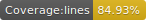

# Shorts or Pants

A weather app telling you whether you should wear shorts or pants today.

## Development

1. `yarn dev` to start webpack and the node server
2. go to [localhost:3000](http://localhost:8080)

## Deployment

1. `yarn build` to build the webapp
2. `yarn start` to start the node server
